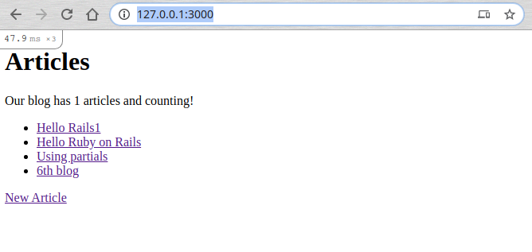

# Rails Blog App
This is the second project in the Rails curriculum. The goal is to build a simple blog that follows the MVC methodology, or CRUD.
Various HTTP methods are used e.g GET, POST, UPDATE and DELETE.

Other concepts include:
- Routing
- Controllers
- Views
- Partials

## GETTING STARTED
To have a local version of this code running do the following:
- Clone the repository `git@github.com:kimothokamau/rails_blog.git`
- Install ruby, rails, node, sqlite3, yarn
- Navigate to the directory containing this code
- Run the command `rails server` 

## Built With

- Ruby with ERB
- Rails

## Live Demo

Working on it

## Authors

👤 **Kimotho Kamau**

- GitHub: [@kimothokamau](https://github.com/kimothokamau)
- LinkedIn: [LinkedIn](https://www.linkedin.com/in/kimotho-kamau-6ab307185/)

👤 **Alexis Varela**

##  Contributing

Contributions, issues, and feature requests are welcome!

## Show your support

Give a ⭐️ if you like this project!

## License

This project is [MIT](./LICENSE) licensed.